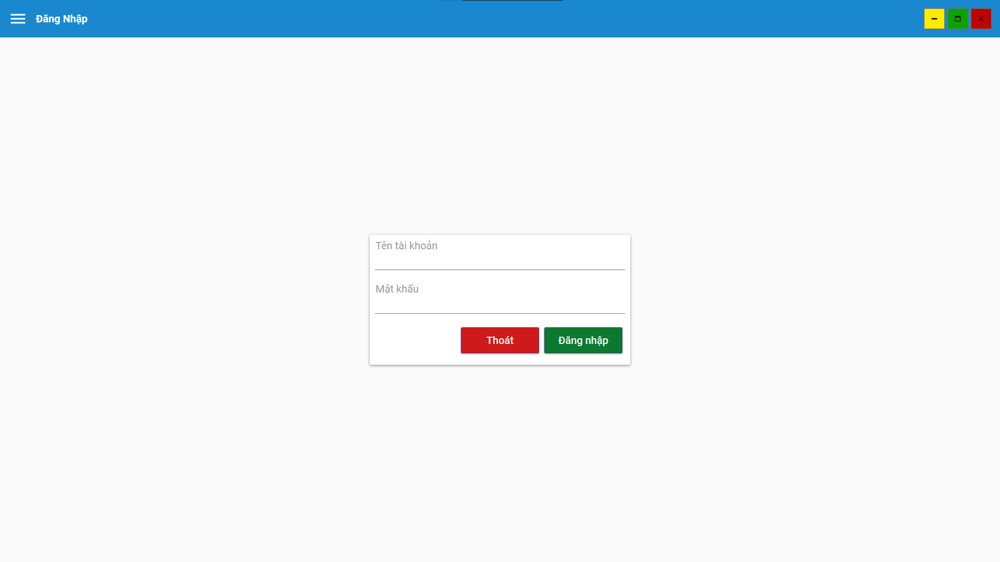

> [!IMPORTANT]
> THIS IS JUST A PROJECT FOR STUDYING PURPOSE

> [!CAUTION]
> The function **General Report** is **NOT COMPLETE**
# Network Processing (Self-project)
### Description
  - This project is use for manage library base on C#, WPF, EF core
  - Using MVVM model
  - It manage books in library, customer, employee, which customer borrows books, does the book returned, etc..
### Technology
  - Language: C#: WPF, EF core
  - Database: MSSQL Server
### Members
  - [Le Minh Thuan](https://github.com/minhthuan26)
### Main Function & UI
  > - Login
  > 
  >
  > - General 
  > 
  >
  > - Book Management
  >  
  >
  > - Book Gern Management
  >  
  >
  > - Author Management
  >  
  >
  > - Borrow Book Management
  >  
  >
  > - Book Return Management
  >  
  >  
  >
  > - Compensation Management
  >  
  >
  > - Customer Management
  >  
  >
  > - Employee Management
  >  
  >
  > - Position Management
  >  
  >
  > - Account Management
  > 
### HOW TO RUN
  - Clone this project from github: ```git clone https://github.com/minhthuan26/Library-Management.git```
  - Install .NET 6 from [.NET 6](https://dotnet.microsoft.com/en-us/download/dotnet/6.0)
  - Install MSSQL Server from [MSSQL Server](https://www.microsoft.com/en-us/sql-server/sql-server-downloads)
  - Create SQL Server Database name **QuanLiThuVien** by run this file script ```sql/data.sql.sql```
  - Open project on Visual Studio _[_**If you don't have it, please install: [Visual Studio](https://visualstudio.microsoft.com/)]*
  - Press ```Ctrl + F5``` to run

